# 图书管理系统

基于 **Spring Boot + Thymeleaf + Tailwind CSS** 的 Web 图书借阅管理系统，支持用户借阅和管理员后台管理。

## 项目功能

### 用户端（前台）

- 用户注册 / 登录 / 登出
- 图书搜索（支持书名、作者、ISBN、类别模糊查询）
- 图书列表展示（含封面、库存、可借数量）
- 图书借阅（需登录）
- 查看个人借阅记录（显示借阅日期、应还日期、状态、逾期标记）
- 图书归还

### 管理员端（/admin/*）

- 图书管理：增删改查（含类别选择、ISBN 唯一校验）
- 类别管理：增删改查
- 用户管理：查看列表、编辑信息、调整角色
- 借阅记录总览：分页、排序查看所有借阅记录

## 技术栈

- **后端**：Spring Boot 3.x + Spring Data JPA
- **数据库**：MySQL 8.0
- **前端**：Thymeleaf + Tailwind CSS + Font Awesome
- **构建工具**：Maven
- **安全**：基于 Session 的简单角色控制

## 快速开始

### 1. 环境要求

- JDK 17+
- Maven 3.6+
- MySQL 8.0+
- 推荐 IDE：IntelliJ IDEA

### 2.修改 src/main/resources/application.properties 中的数据库连接：
spring.datasource.url=jdbc:mysql://localhost:3306/library_db?useSSL=false&serverTimezone=Asia/Shanghai&allowPublicKeyRetrieval=true
spring.datasource.username=root
spring.datasource.password=你的数据库密码
spring.jpa.hibernate.ddl-auto=update

## 3.运行项目
### 编译打包
mvn clean package

### 运行
IDEA 直接运行 LibraryManagementSystemApplication 主类

- 默认访问地址：http://localhost:8081

- 前台首页：http://localhost:8081/
- 登录页：http://localhost:8081/login
- 管理后台：http://localhost:8081/admin/books （需管理员权限）

## 4.默认测试账号
- 管理员：用户名 admin / 密码 123456 （role=ADMIN）
- 普通用户：自行注册

## 5.功能与视图展示
### 5.1 登录与注册
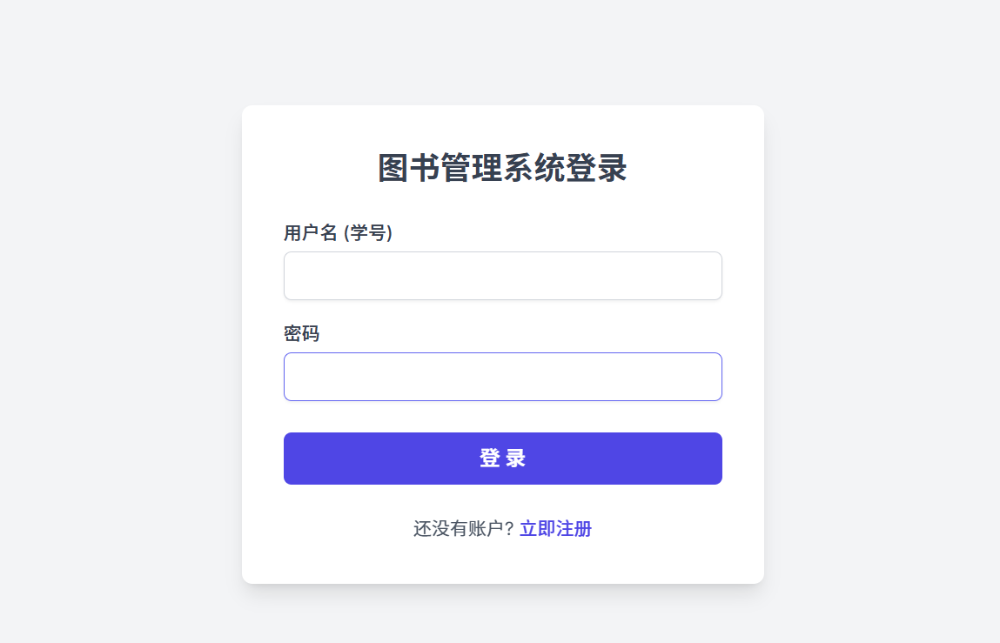
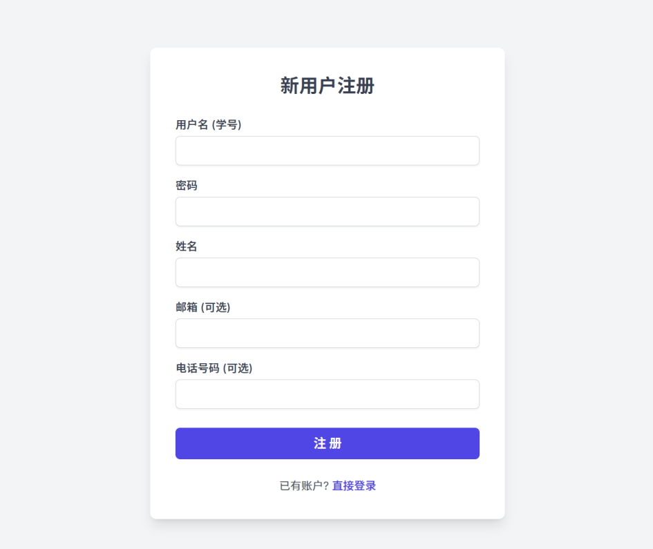

### 5.2 多重检索
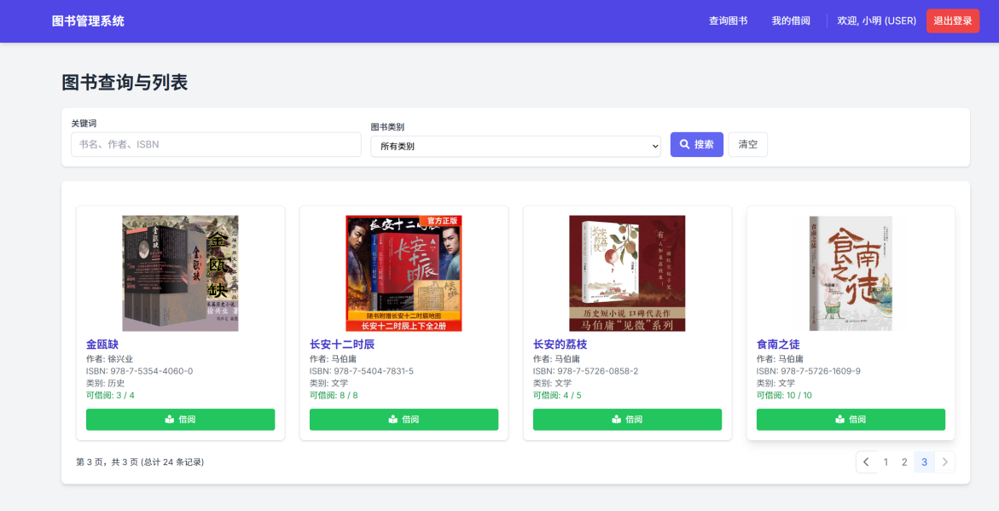
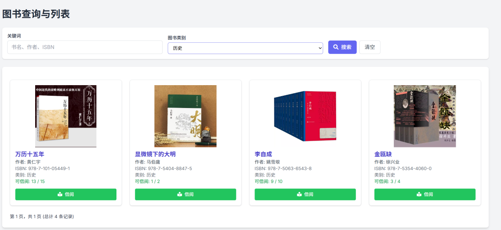
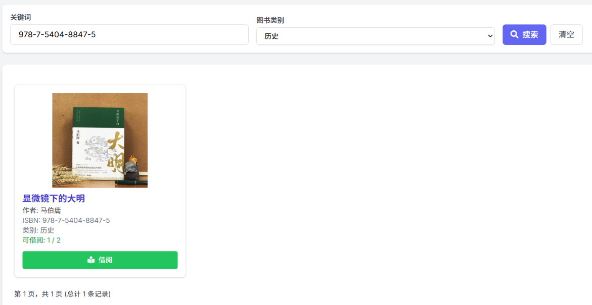
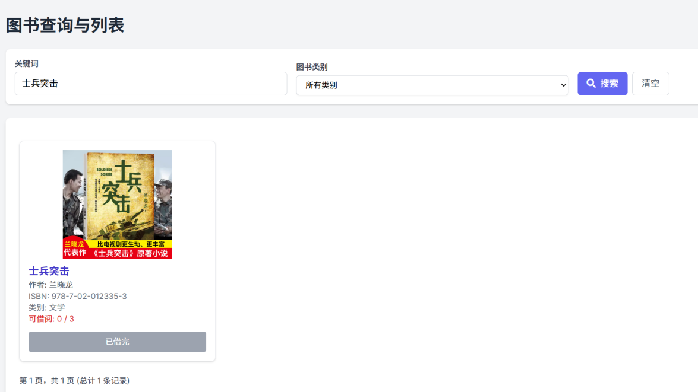

### 5.3 图书借阅
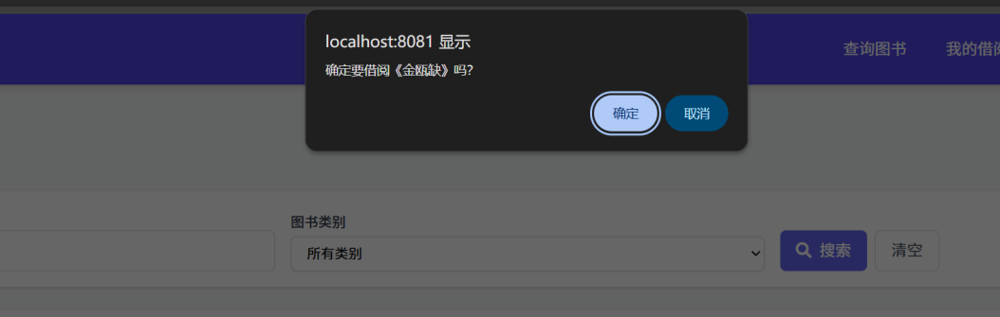
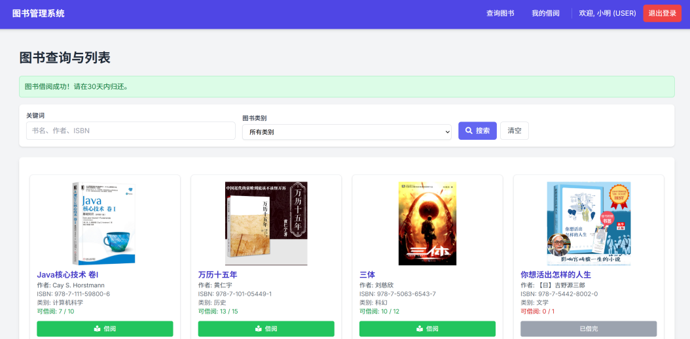

### 5.4 图书归还
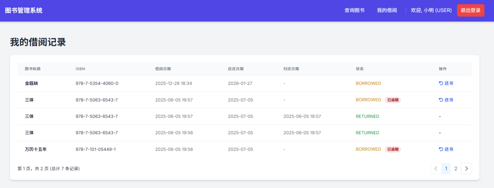
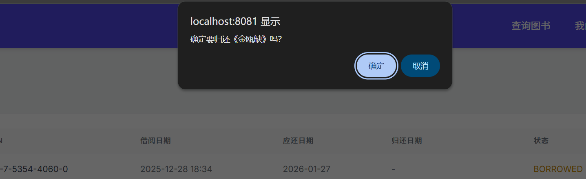
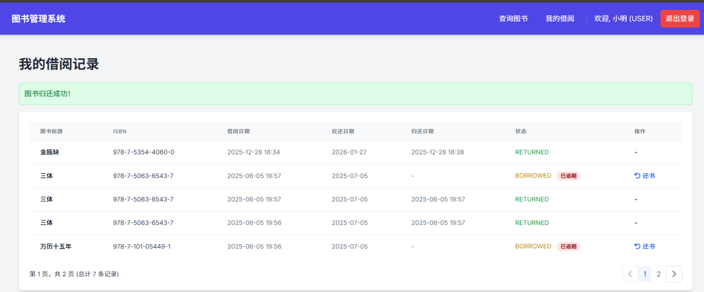

### 5.5 用户视图
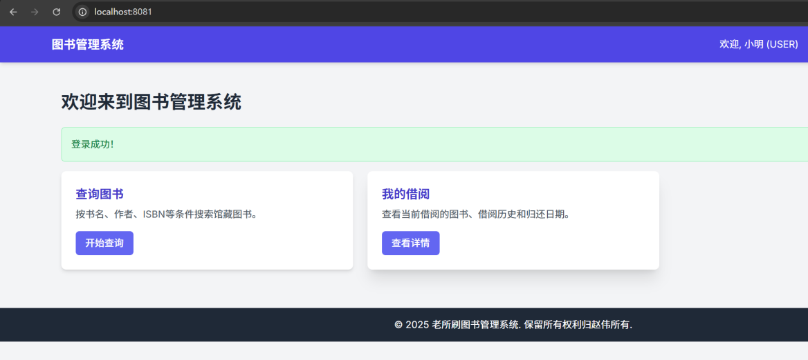

### 5.6 管理员视图
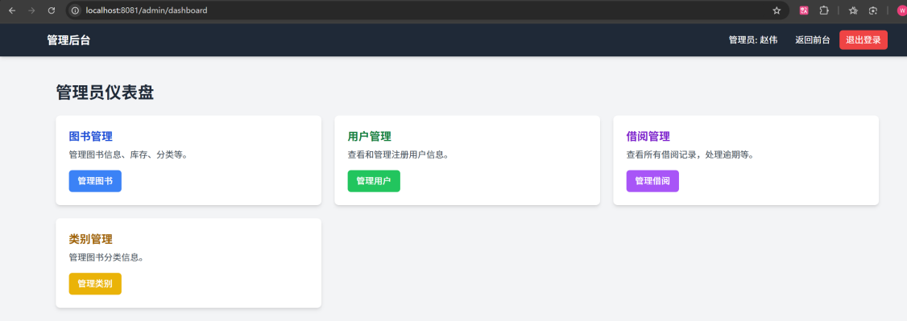

### 5.6.1 图书信息管理
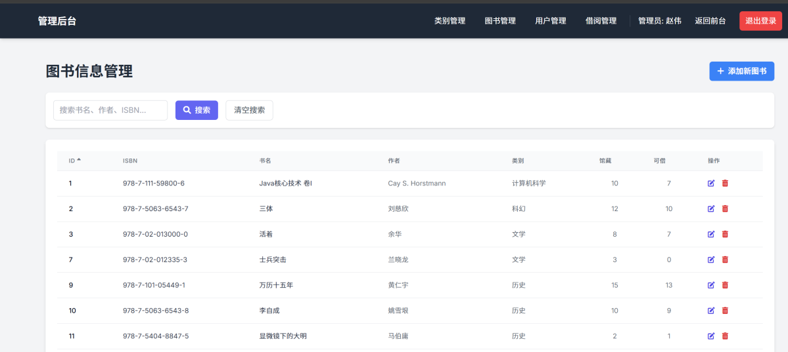

### 5.6.2 图书类别管理
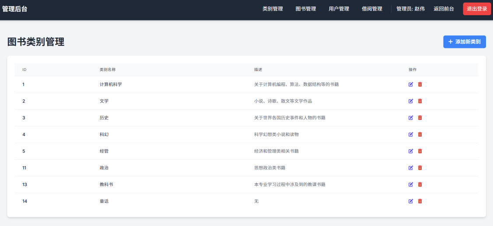

### 5.6.3 用户管理
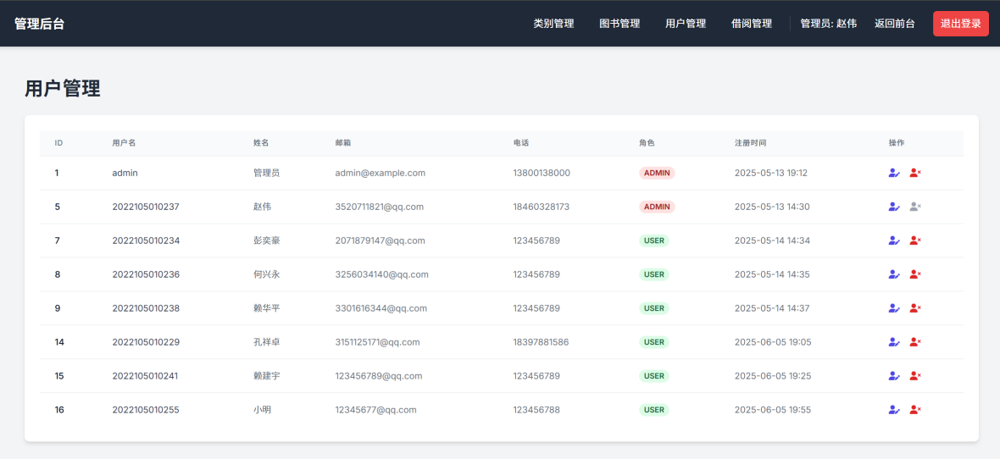

### 5.6.4 借阅记录
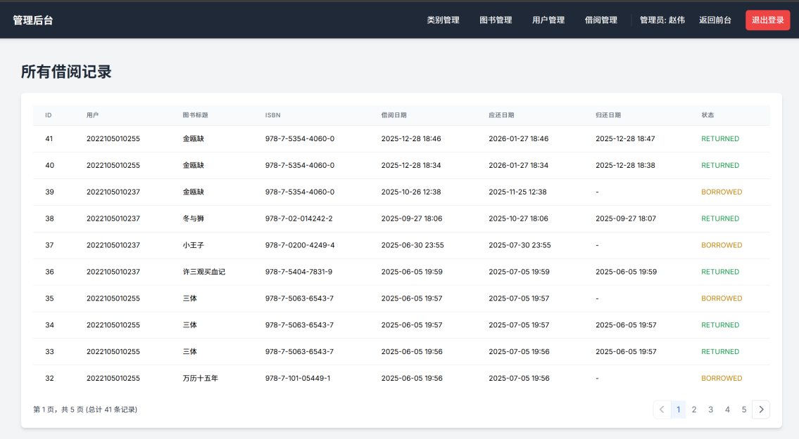

## 6.未来改进方向

- 集成 Spring Security + JWT 认证
- 支持图书封面图片上传
- 添加逾期自动计算罚款
- 增加图书预约 / 续借功能
- 添加用户借阅请求，由管理员决定是否借阅
- 移除管理员删除用户权限
- 前端升级为 Vue 3 或 React

